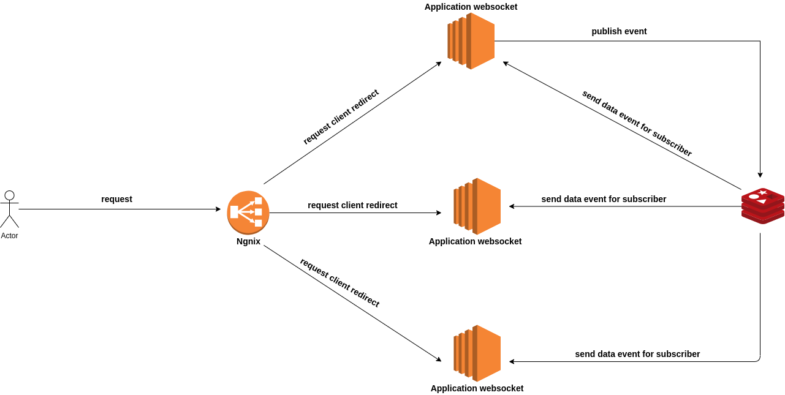

The project focus:
===================
 - The project have goal the learn about how to scale websocket application. This anknowledge
 will be used for build html5 game multiplayer more later.

Instructions running project:
==============================

- Clone project
- Create file **.env** based in **.env.example** file.
- Execute command: **docker-compose build && docker-compose up -d**
- After execute command above the application is running in localhost:8000

Architecture:
===============

Explain image above:
=====================
 - Client make request
 - Request incoming proxy(nginx) that send for one application websocket
 - When one client execute one action is publish event with data
 - All instances application websocket listen and execute someone action.
 - **OBS:** redis is used here with pub/sub broker
 
Video show appliation:
=======================
Link: https://github.com/tiago123456789/playing-studying-websocket-scale/blob/master/video.mp4

